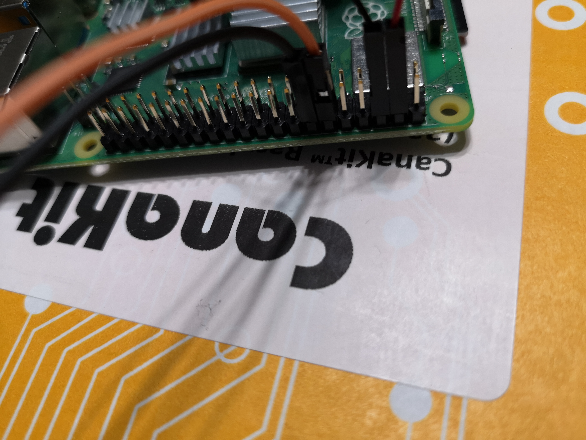
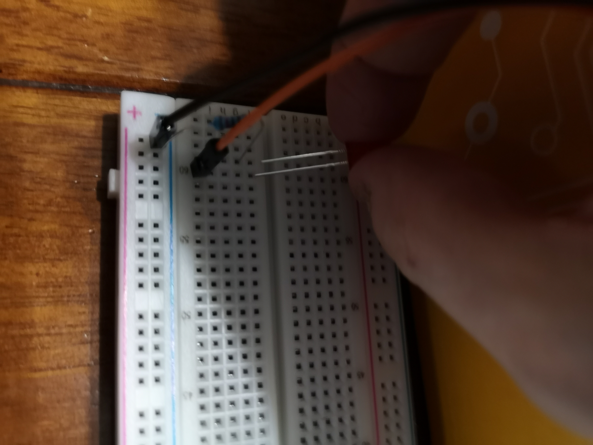
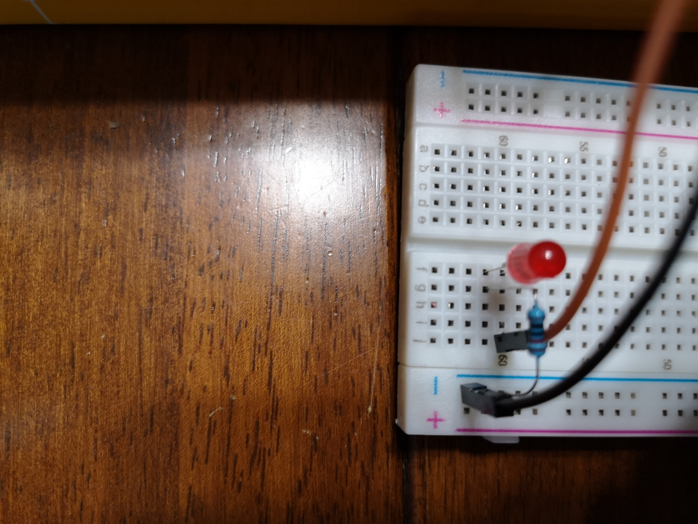
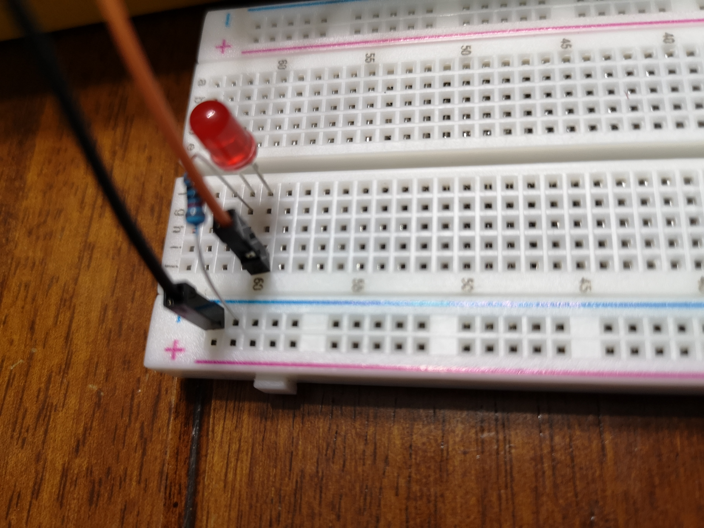

# Allumer une seule lumière avec le Raspberry Pi 4 en Python

Voici les étapes à suivre pour être en mesure d'allumer une simple LED via un breadboard.

## Composantes

Pour l'exercice, il faut avoir en main les composantes suivantes :

- une LED
- un _resistor_
- un _breadboard_

## Précautions

Pour prévenir les potentiels problèmes, faites attention à l'orientation de la _breadboard_.

De plus, sachez que la patte la plus longue correspond à l'anode (positif) et la patte la plus courte la cathode (négatif).

Pour terminer, il est nécessaire d'être en mesure de différencier [le mode BCM versus le mode BOARD](https://raspberrypi.stackexchange.com/questions/12966/what-is-the-difference-between-board-and-bcm-for-gpio-pin-numbering).

## Exercice

L'[exercice](https://thepihut.com/blogs/raspberry-pi-tutorials/27968772-turning-on-an-led-with-your-raspberry-pis-gpio-pins) est basé sur la démonstration sur __thepihut__.

Le [diagramme de circuit](https://cdn.shopify.com/s/files/1/0176/3274/files/LEDs-BB400-1LED_bb_grande.png?6398700510979146820
) est également disponible.

## Illustrations

Voici quelques illustrations pour faciliter l'interprétation du diagramme :

_Dans le cadre du cours 420-253-MT Objets connectés_

Tous droits réservés 2021 © Alexis Garon-Michaud
